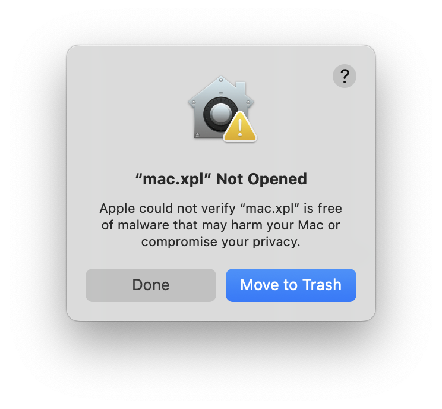
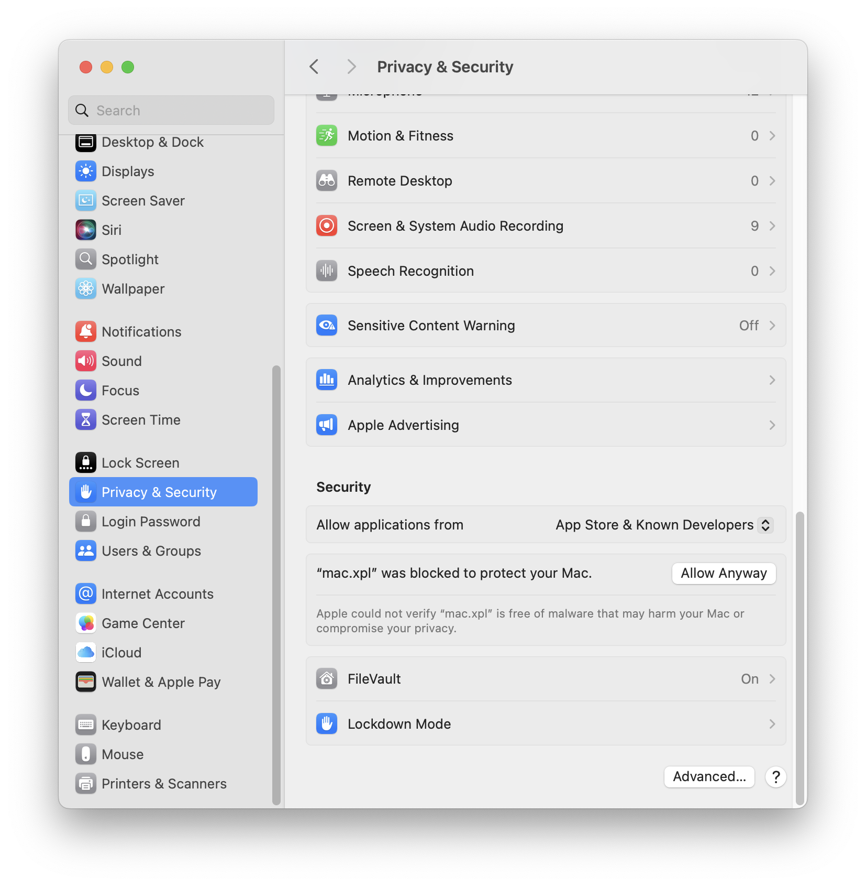

# XPL/Pro

Fork of [XPLPro_Official by Giorgio Croci Candiani](https://github.com/GioCC/XPLPro_Official). This is also fork of original [XPLPro project by Michael Gerlicher](https://github.com/curiosity-workshop/XPLPro).

Original plug-in is distributing on [Patreon](https://www.patreon.com/posts/introducing-xpl-82145446). [There](https://www.patreon.com/c/curiosityworkshop/posts) are several examples.

✅ Arm mac (tested on macOS 26.3.1, X-Plane 12)<br />
✅ Intel mac (tested on macOS 15.7.4, X-Plane 12)<br />
✅ Windows (tested on Windows 11 Pro 25H2, X-Plane 12)<br />
I don't have any motivation on Linux port.

**You can download built binary from [Releases](https://github.com/ytsuboi/XPLPro/releases).**

## macOS Gatekeeper warning



Because the plugin binary is not signed with an Apple Developer ID, macOS may show an **"Apple could not verify"** dialog the first time the plugin is loaded. To resolve this, remove the quarantine attribute from the file:

```bash
xattr -d com.apple.quarantine mac.xpl
```



Alternatively, go to **System Settings → Privacy & Security** and click **"Allow Anyway"** after the first blocked attempt.

This only needs to be done once per downloaded binary.

## Configuration file (`XPLPro.cfg`)

The plugin reads its settings from a configuration file located at:

```
X-Plane 12/Resources/plugins/XPLPro/XPLPro.cfg
```

The file uses the [libconfig](https://hyperrealm.github.io/libconfig/) format.
All settings are placed inside an `XPLProPlugin` group.

### Syntax rules

- Groups are enclosed in `{ }` and end with a `;`
- String values are enclosed in double quotes (`"..."`)
- Lists (arrays of strings) use parentheses: `( "a", "b" )`
- Integer values are written without quotes
- Comments are C-style: `//` for single-line, `/* ... */` for block

### Available settings

| Setting | Type | Default | Description |
|---------|------|---------|-------------|
| `logSerialData` | integer | `0` | Set to `1` to enable serial data logging to `XPLProSerial.log`. Useful for debugging communication with Arduino devices. Can also be toggled from the plugin menu in X-Plane. |
| `ignoreSerialPorts` | list of strings | *(empty)* | Serial port names to skip during device scanning. Matched ports are never opened. On macOS use the full `/dev/tty.*` path. On Windows you can use just the short name like `"COM3"`. |

### Example (macOS)

```
XPLProPlugin:
{
  logSerialData = 0;
  ignoreSerialPorts = (
    "/dev/tty.Bluetooth-Incoming-Port",
    "/dev/tty.usbmodem-SomethingElse"
  );
};
```

### Example (Windows)

```
XPLProPlugin:
{
  logSerialData = 1;
  ignoreSerialPorts = ( "COM3", "COM5" );
};
```

> **Note:** If the configuration file does not exist, the plugin will log a
> warning and run with default values. The `ignoreSerialPorts` list is
> optional — when omitted, all discovered ports are scanned.

## Building on macOS

The plugin builds as a Universal Binary (x86_64 + arm64) via CMake.

### Prerequisites

- Xcode Command Line Tools (`xcode-select --install`)
- CMake 3.15 or later (`brew install cmake`)
- Homebrew libconfig — used for headers at build time (`brew install libconfig`)

### About libconfig

The plugin links `libconfig` **statically** so distributed `mac.xpl` has no
runtime dependency on Homebrew. A vendored universal static library is
committed at [`XPLPro_Plugin/libconfig_mac.a`](XPLPro_Plugin/libconfig_mac.a)
(contains both `x86_64` and `arm64` slices).

`brew install libconfig` is still required **at build time** because CMake
uses `pkg-config` to locate the libconfig headers.

#### Recreating `libconfig_mac.a` (if you need to rebuild it)

Intel Homebrew only ships the `x86_64` slice, and Apple Silicon Homebrew only
ships the `arm64` slice. To build a universal `.a`, fetch both bottles and
combine them with `lipo`:

```bash
# x86_64 side (already installed via `brew install libconfig`)
X86_LIB=/usr/local/lib/libconfig.a

# arm64 side — fetch the arm64 bottle without installing it
brew fetch --force --bottle-tag=arm64_sonoma libconfig
ARM_BOTTLE=$(brew --cache --bottle-tag=arm64_sonoma libconfig)
mkdir -p /tmp/libconfig_arm64
tar -xzf "$ARM_BOTTLE" -C /tmp/libconfig_arm64
ARM_LIB=/tmp/libconfig_arm64/libconfig/*/lib/libconfig.a

# Combine into a universal static archive
lipo -create $X86_LIB $ARM_LIB -output XPLPro_Plugin/libconfig_mac.a
lipo -info XPLPro_Plugin/libconfig_mac.a
# → Architectures in the fat file: ... are: x86_64 arm64
```

### Build steps

```bash
cd XPLPro_Plugin
mkdir build_mac && cd build_mac
cmake .. -DCMAKE_BUILD_TYPE=Release
make -j$(sysctl -n hw.ncpu)
```

The output is `build_mac/mac.xpl` (Universal Binary). Verify with:

```bash
lipo -info build_mac/mac.xpl
otool -L  build_mac/mac.xpl   # should only reference X-Plane frameworks + OS libs
```

### Installation

Copy `mac.xpl` to your X-Plane installation:

```
X-Plane 12/Resources/plugins/XPLPro/64/mac.xpl
```

## Building on Windows (without Visual Studio)

Microsoft provides a free, command-line-only distribution of the
MSVC toolchain called **Build Tools for Visual Studio**, which is sufficient
to build `win.xpl` with the CMake project in this repository.

### Prerequisites

1. **Build Tools for Visual Studio 2022** (free)
   - Download from https://visualstudio.microsoft.com/downloads/
     → scroll to the "Tools for Visual Studio" section
     → **Build Tools for Visual Studio 2022**
   - In the installer, select the **"Desktop development with C++"**
     workload. Make sure these individual components are included:
     - MSVC v143 C++ build tools
     - Windows 11 SDK (or Windows 10 SDK)
     - C++ CMake tools for Windows
   - Disk space: roughly 6–8 GB.
   - License: free for individuals, open source, academic use, and small
     teams.

2. **CMake** — already included with the "C++ CMake tools for Windows"
   component above. No separate install needed.

All Windows dependencies required by the build
(`SDK/Libraries/Win/XPLM_64.lib`, `SDK/Libraries/Win/XPWidgets_64.lib`, and
`libconfig.lib` at the project root) are already vendored in this
repository, so no additional libraries need to be installed.

### Build steps

Open **"x64 Native Tools Command Prompt for VS 2022"** from the Start menu
(this sets up the MSVC environment variables), then run:

```cmd
cd XPLPro_Plugin
mkdir build_win
cd build_win
cmake .. -G "Visual Studio 17 2022" -A x64
cmake --build . --config Release
```

The output is `build_win\Release\win.xpl`.

Alternatively, if you prefer a faster single-config build with Ninja
(bundled with the CMake tools component):

```cmd
cd XPLPro_Plugin
mkdir build_win
cd build_win
cmake .. -G "Ninja" -DCMAKE_BUILD_TYPE=Release
ninja
```

With Ninja the output is `build_win\win.xpl`.

### Installation

Copy `win.xpl` to your X-Plane installation:

```
X-Plane 12\Resources\plugins\XPLPro\64\win.xpl
```
